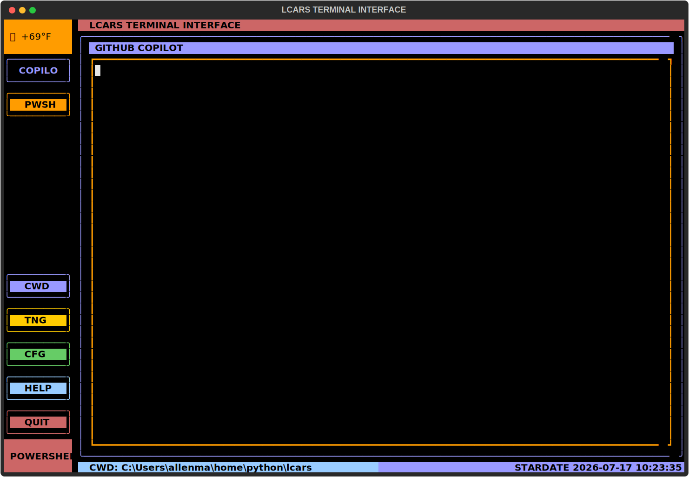
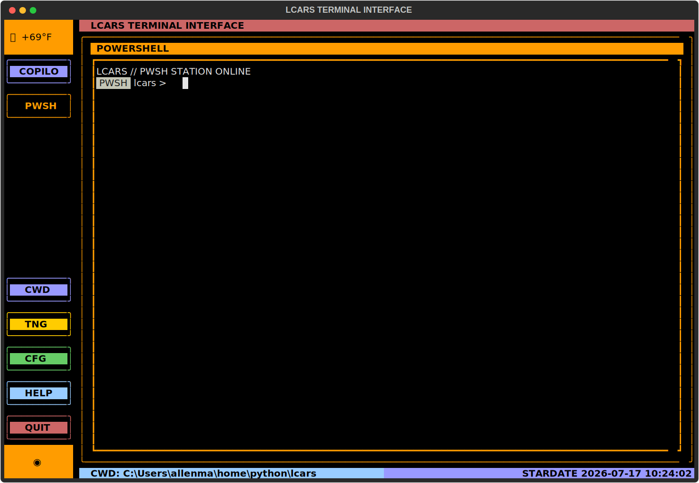

# LCARS Terminal Interface

A one-screen, LCARS (Star Trek console) styled TUI that hosts several real,
interactive terminal programs as full-size tabs: PowerShell, the GitHub
Copilot CLI, and any other console command you like.

Built with [Textual](https://github.com/Textualize/textual). Each pane is a
genuine Windows console session created via ConPTY (`pywinpty`) and rendered
with a terminal-emulator state machine (`pyte`), so colors, cursor movement,
and fully interactive programs work as expected. Only one pane is shown at a
time (like browser tabs) so each station gets the full screen — the others
keep running in the background and are instant to switch back to.

## Screenshots

| Copilot tab | PowerShell tab |
| --- | --- |
|  |  |

Both were captured headlessly straight from the app itself (Textual's
`App.save_screenshot()` under `run_test()`), so they reflect the real
rendering rather than a mockup. Regenerate them after a visual change with:

```powershell
$env:LCARS_START_DIR = (Get-Location).Path
.\.venv\Scripts\python.exe -c "
import asyncio
from lcars_tui.app import LcarsApp

async def main():
    app = LcarsApp()
    async with app.run_test(size=(120, 40)) as pilot:
        await pilot.pause()
        await asyncio.sleep(1.5)
        app.save_screenshot('docs/screenshots/copilot-tab.svg')

asyncio.run(main())
"
```

## Setup

```powershell
python -m venv .venv
.\.venv\Scripts\pip.exe install --no-index --find-links <your-wheelhouse> -r requirements.txt
```

## Run

```powershell
.\.venv\Scripts\python.exe -m lcars_tui
```

## Usage

- Sidebar buttons `COPILOT` / `PWSH` switch the visible tab; `AUX` opens a
  third, hidden-by-default terminal tab, or closes it again if it's already
  showing.
- `Ctrl+1` / `Ctrl+2` / `Ctrl+3` — switch tabs from the keyboard (Copilot /
  PowerShell / Aux), even while a terminal has focus. These keys are
  reserved and never forwarded to the shell running inside a pane.
- `Ctrl+N` — open a dialog to launch a new pane running any command (it
  becomes its own tab).
- `Ctrl+K` — kill the focused pane's process.
- `Ctrl+R` — restart the focused pane's process.
- `Ctrl+G` — change the focused pane's working directory: opens a dialog
  pre-filled with its current directory, then restarts its process in the
  directory you enter (validated to exist first; invalid input just beeps
  and leaves the pane untouched). Also available via the `CD` sidebar
  button.
- `Ctrl+T` — toggle the whole app's color theme between the classic cool
  "TNG" orange/lilac/blue palette and a warmer "DS9" red/gold/amber one.
  Also available via the `THEME` sidebar button. Every `$lcars-*` CSS
  variable is redefined per theme in `LcarsApp.get_css_variables()`
  (`THEMES` in `app.py`), so this recolors the sidebar, panes, status
  bars, and elbows all at once -- add a new palette there (and to
  `THEME_ORDER`) to add more themes.
- `Ctrl+Q` — quit (also available via the `QUIT` sidebar button).
- `Ctrl+B` — open a dialog to show/hide individual sidebar buttons (also
  available via the `CFG` sidebar button). Hidden buttons are just visually
  removed from the sidebar; their keybindings still work, and the `CFG`
  button itself can't be hidden so you can always get back in.
- `F1` — show a help screen listing every keybinding (also available via the
  `HELP` sidebar button). Dismiss with any key or its button.
- Click into any pane and type normally — keystrokes are forwarded to the
  real console process running inside it.
- **Scrollback** — scroll a pane's history with the mouse wheel,
  `Shift+PageUp` / `Shift+PageDown`, or jump to the ends with `Ctrl+Home` /
  `Ctrl+End`. A status footer shows your position; typing any key snaps
  back to the live view.
- **Search** — `Ctrl+F` opens a search box for the focused pane's
  scrollback; press it again (or re-enter the same term) to cycle to older
  matches, wrapping around once you reach the top.
- **Copy/paste** — click-drag to select text in a pane and press `Ctrl+C`
  to copy it (Textual's built-in selection/clipboard support, via OSC52).
  Pasting into the outer terminal hosting the app writes the pasted text
  straight into the focused pane's process.
- **Closable panes** — `AUX` and any pane created via `Ctrl+N` ("STATION
  N") show a small `✕` button in their header to stop the process and
  close the tab, falling back to the `COPILOT` tab if it was active. The
  default `COPILOT` / `PWSH` panes cannot be closed.

## Usage examples

A few common workflows, end to end:

**Run a one-off command in a new tab without disturbing COPILOT/PWSH.**
Press `Ctrl+N`, type the command (e.g. `git log --oneline -20` or `htop`),
and press Enter/CONTINUE. It opens as its own "STATION N" tab; switch back
to it any time and close it with the `✕` in its header when you're done.

**Work in a different repo/folder without restarting the app.** Click into
(or Tab-focus) the pane you want to redirect, press `Ctrl+G`, clear the
prefilled path and type the new directory, then confirm. That pane's shell
restarts in the new directory; other panes are untouched. Use the `CD`
sidebar button if you'd rather click than remember the shortcut.

**Find something you scrolled past.** Focus the pane, press `Ctrl+F`, type
a search term and press Enter — it jumps to the most recent match and
highlights it. Press `Ctrl+F` again (same term) to keep walking backwards
through older matches.

**Copy output from a pane into another program.** Click-drag over the text
in a pane to select it, then `Ctrl+C`. The selection is written to the
clipboard via OSC52, so it works even though the pane is a remote-looking
ConPTY session, not the outer terminal.

**Declutter the sidebar.** Press `Ctrl+B` (or click `CFG`) and uncheck any
buttons you don't use day-to-day (e.g. `AUX` or `THEME`). Their keybindings
still work — this only hides the button, and `CFG` itself always stays
visible so you can bring buttons back later.

**Always start in a specific project folder.** Set `LCARS_START_DIR` (env
var, `.env` file, or accept the native folder-picker on first launch and
choose to save it) so every pane — including future `Ctrl+N` stations and
`AUX` — opens there by default. See
[Starting panes in a particular directory](#starting-panes-in-a-particular-directory)
below for the full resolution order.

## LCARS prompt

The PowerShell and Aux panes launch with `-NoProfile` and a small custom
prompt (`lcars_tui/assets/lcars_prompt.ps1`) instead of your normal profile
(Starship, Oh My Posh, etc.), so they stay compact and match the console
theme. Edit that script to change the prompt's look, or pass a different
`-Accent`/`-Label` when building the command in `lcars_tui/app.py`.

## Portable build (no Python required on the target machine)

A standalone build can be produced with [PyInstaller](https://pyinstaller.org)
so the app runs on any Windows machine without installing Python or any
dependency:

```powershell
.\build.ps1
# or, if PyInstaller isn't installed yet and you have a wheelhouse:
.\build.ps1 -Wheelhouse <your-wheelhouse>
```

This runs `pyinstaller lcars.spec` and produces a folder at `dist\lcars\`
containing `lcars.exe` plus all its dependencies (Textual, pywinpty's native
DLLs, etc.). Zip up `dist\lcars\` and copy it anywhere -- run `lcars.exe`
from inside that folder.

Notes:
- It's a **onedir** (folder), not onefile, build on purpose: onefile
  re-extracts pywinpty's native DLLs into a temp dir on every launch, which
  is slower to start and more likely to trigger antivirus heuristics.
- `lcars.spec` explicitly lists `lcars_tui/lcars.tcss` and
  `lcars_tui/assets/lcars_prompt.ps1` as `datas` -- PyInstaller only
  auto-bundles `.py` files, so any new non-Python asset added under
  `lcars_tui/` (fonts, scripts, etc.) needs to be added to `datas` in
  `lcars.spec` too, or the frozen build won't find it.
- The console window is kept (`console=True` in the spec) since this is a
  terminal UI, not a windowed GUI app.
- `lcars.exe` is built with an LCARS-panel-inspired icon
  (`lcars_tui/assets/lcars.ico`). It's a committed, generated asset -- run
  `.\.venv\Scripts\python.exe tools\make_icon.py` to regenerate it if you
  want to tweak the design (pure stdlib PNG/ICO writer; Pillow isn't
  available for this project's Python version in the offline wheelhouse).

### Desktop shortcut

To launch from the Desktop or Start menu, create a shortcut to
`dist\lcars\lcars.exe` (e.g. right-click the exe in Explorer ->
"Show more options" -> "Send to" -> "Desktop (create shortcut)", or via
PowerShell):

```powershell
$ws = New-Object -ComObject WScript.Shell
$s = $ws.CreateShortcut("$([Environment]::GetFolderPath('Desktop'))\LCARS Terminal.lnk")
$s.TargetPath = "C:\path\to\dist\lcars\lcars.exe"
$s.WorkingDirectory = "C:\path\to\dist\lcars"
$s.IconLocation = "$($s.TargetPath),0"
$s.Save()
```

### Starting panes in a particular directory

By default, PowerShell/Copilot panes open wherever the process itself was
started from -- for a double-clicked exe (or a plain shortcut) that's the
exe's own folder (`dist\lcars\`), which usually isn't where you want to
work. The working directory is resolved in this order:

1. The `LCARS_START_DIR` environment variable, if set.
2. `LCARS_START_DIR=...` in a `.env` file next to `lcars.exe` (next to the
   repo root when running from source).
3. If neither is set, a native OS "Select Folder" dialog (not part of the
   TUI) pops up *before* the app itself even starts, then a native yes/no
   dialog asks whether to save that directory to `.env` as the default for
   future launches (choosing not to save just uses it for this run).

Every pane (including new ones from Ctrl+N and the AUX terminal) launches
its shell in whichever directory is resolved.

A `.lnk` shortcut can't set an environment variable directly, so to use
option 1 either set it globally (`setx LCARS_START_DIR C:\path\to\project`,
then re-log-in or start a new Explorer session) or point the shortcut at a
one-line wrapper instead of `lcars.exe` directly:

```powershell
# launch-lcars.bat, next to (or pointing at) dist\lcars\lcars.exe
@echo off
set LCARS_START_DIR=C:\path\to\project
start "" "C:\path\to\dist\lcars\lcars.exe"
```

Then make the Desktop shortcut's target `launch-lcars.bat` instead of
`lcars.exe`. Otherwise, just let the startup folder dialog save it to
`.env` -- no shortcut editing needed.

To change directory from *inside* a running app (no restart of the whole
app or shortcut editing needed), press `Ctrl+G` on a focused pane -- see
the keybindings list above.

## Customizing stations

Edit `DEFAULT_PANES` (and `AUX_PANE`) in `lcars_tui/app.py` to change the
default set of panes, their titles, accent colors, and the command each one
launches (e.g. swap `copilot` for another CLI tool, or add `wsl.exe`, `ssh`,
etc.).
